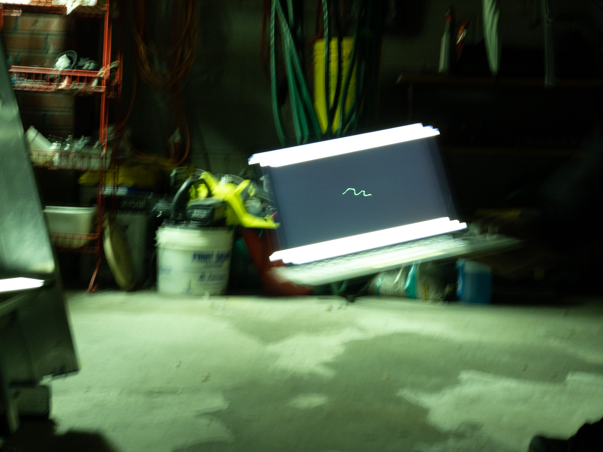
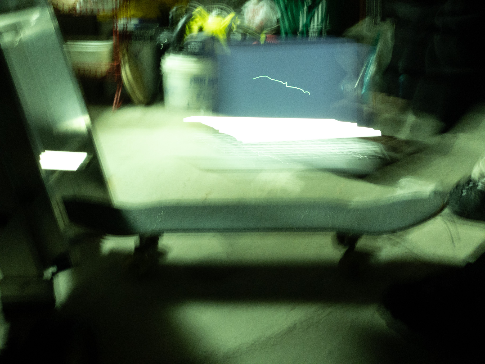
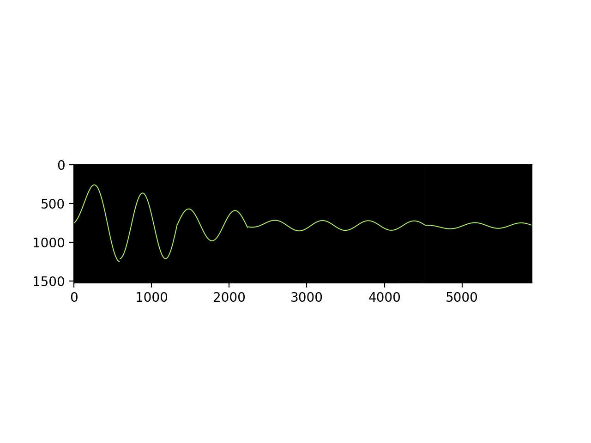

# Sonar Vision
### ECE516 Lab 
Lab was designed by Steve Mann and his students at the University of Toronto.
This is my attempt at the experiment and my results. 

## Generating Sound
In order to generate a cosine or sine tone the module pyaudio is needed.
'src/capture.py' contains multiple functions to generate sounds these tones at
different frequencies and sampling rates. These functions are used throughout
the repository.

## S.W.I.M. (Sequential Wave Imprinting Machine)
The goal of the lab was to build a soft implementation of a lock in amplifier
(real and complex) to map out the sound waves from a speaker. 

1. 'src/swim.py'
2. 'src/swim_dot.py'
3. 'src/swim_complex.py'
4. 'src/sonar.py'

All perform these tasks differently. In order to run any of these programs, in
the command line run 'python3 <file> <duration of output signal in s>' to
generate a life graphic. 

### swim.py
This file generates a display of a SWIM. The lock-in amplifier has a lower bound
of 40Hz which can be adjusted. The output of the amplifier is multiplied by a
constant 'GAIN' to increase the amplitude of the output signal for more visible
results. 

### swim_dot.py
This program acts similarly to 'swim.py' excepts instead of outputting a wave it
output a single dot that moves up and down reflecting the oscillating sound
waves. This program is suitable for mapping a sound waves a of a speaker in
real time using long exposure photography. 

### swim_complex.py
Instead of a real lock in amplifier this program uses a complex lock in amplifier
and displays the results on an Argand plane. 

### sonar.py
This program is ideal for sonar applications. Instead of simply passing the
recorded and reference signal through a lock in amplifier this program goes the
extra step and uses a quadratic chirplet transform to build the tfd of the
output of the lock in amplifier. The quadratic transform is implemented through
the file 'polynomial_chirp_trans.py' that contains a class that can be used to
calculate the polynomial chirplet transform for any signal of any degree. (The
window and overlap can be changed but the window is set to be gaussian). 

Based on what we expect of the output of the low pass filter in the lock in
amplifier the lower signal band of the output should have strong results. So the
output of the entire program is the lower band of tfd.

## Results
Ideally, 'swim_dot.py. Would have been used to draw the sound wave emmiting from
a speaker through long exposure photography. My attempt to do so was
unsuccesful. I initially attempted to use a skateboard to roll my laptop (which
would run the program) and track the output using a long exposure photo app for
iPhone. This failed due to the amount of noise the skateboard created
interfering with the results. 

When the skateboard was removed there was nothing to do except carry the laptop
by hand. To get some feasible results. But this proved to be nearly impossible
-- but more so because the camera app I was using allowed a maximum of 1s
exposure and was too finiky to get reasonable or reproducible results. 

The output is shown below. 

The next step in the lab was to use the same 'swim.py' for mapping distances
from objects ie sonar. But this proved to be equally impossible.

In order to get some semblance of a reasonable result, I ran 'swim.py' and
recorded the laptop screen moving wave from a speaker and crudely connected
frames from the video to capture a virtual result of what one would expect.

